# SIYAM system diagrams

Conceptual, top-level, and level-of-explosion views of the **current** SIYAM
system. Open [`index.html`](index.html) to browse every drawing, or regenerate
from `generate_diagrams.py`.

---

## Plan (how these were made)

These are documentation drawings of the running product, not a redesign.

1. **Read the product, not an unpublished WBS.** Sources were `README.md`,
   `updated_db.md`, `lib/routing/nav_config.dart`, `lib/routing/app_router.dart`,
   the service interfaces under `lib/services/`, and the role pages. A few
   comments mention WBS numbers (`2.4`, `4.1`, `4.2`, `4.3`, `6.1`) but the
   repo does not contain a complete WBS tree, so this set uses its own `0.0` →
   `7.4` numbering derived from modules that actually exist.
2. **Three diagram kinds, used the usual academic way.**
   - **Conceptual** — SIYAM as one system: who uses it, what goes in, what
     comes out, which external systems it talks to.
   - **Top-level** — first explosion of `0.0 SIYAM` into the major modules,
     plus a separate software-layer view of Flutter → services → mock/Supabase
     → data.
   - **Level of explosion** — each top-level module broken into the processes
     the app actually performs. Two extra explosions cover the shared stock
     path and the data stores.
3. **Do not invent.** Boxes are features, tables, and rules that exist in
   code or in `updated_db.md`. Unbuilt items stay out (SIYAM does not
   auto-create purchases from ROP; there is no separate notification table;
   `KNOWN_LIMITATIONS.md` documents non-deductible dispense units).
4. **Format.** Printable SVGs (SIYAM sage / sky / amber palette) plus this
   index. Re-run `python3 generate_diagrams.py` after editing the generator.

How to read the set: start at **01** (context) and **02** (IPO), then **03**
(modules) and **04** (software). **05–11** explode `1.0`–`7.0`. **12** is the
stock path that cuts across inventory, purchasing, donations, and treatments.
**13** is the data stores.

---

## Numbering

| Code | Module | Who uses it |
| --- | --- | --- |
| 0.0 | SIYAM as a whole | all roles |
| 1.0 | Access & Identity | all; Manager also enables/disables Staff |
| 2.0 | Dashboards | Manager / Staff / Donor each have their own home |
| 3.0 | Animal & Medical Care | Manager: animals. Staff: treatments |
| 4.0 | Inventory Control | Staff (Manager stock-in only for donations) |
| 5.0 | Procurement | Manager: suppliers. Staff: Ordering |
| 6.0 | Donations | Donor submits; Manager reviews; Staff/Manager stock in |
| 7.0 | Oversight | Reports, audit, settings, notifications |

---

## Conceptual

### 01 — System context

Actors around SIYAM, the three role portals inside it, and the compile-time
backend (`USE_MOCK`) plus static hosting.

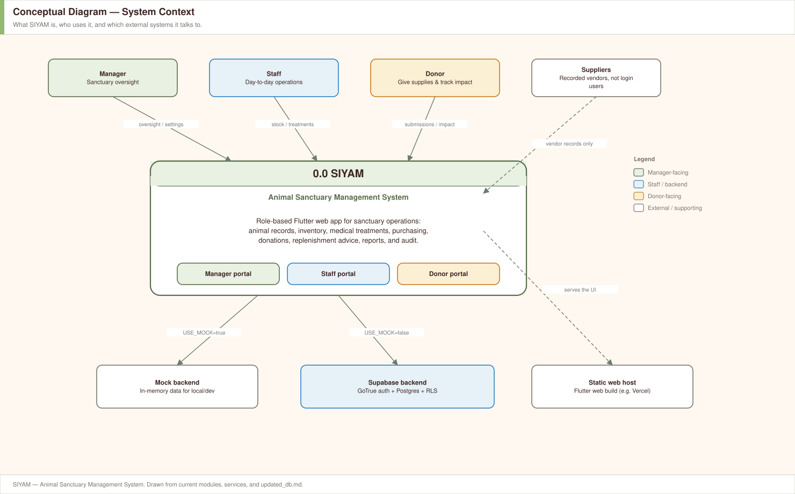

Suppliers are recorded vendors. They are not a login role.

### 02 — Input / process / output

The same system as a single process: what is entered, what SIYAM does, what
it produces.

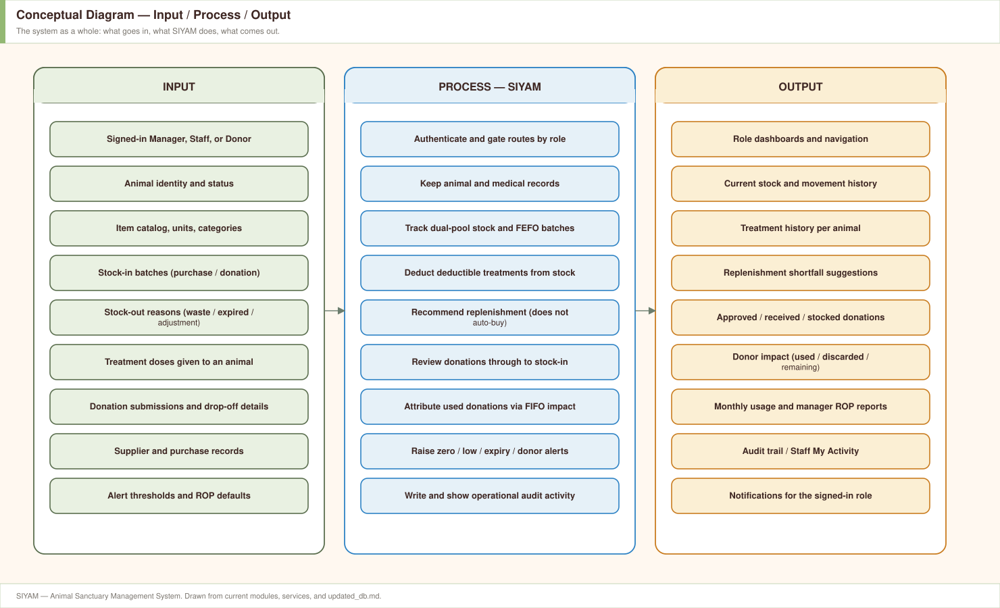

---

## Top-level

### 03 — Functional explosion of 0.0

First decomposition into seven modules. Each is exploded below.

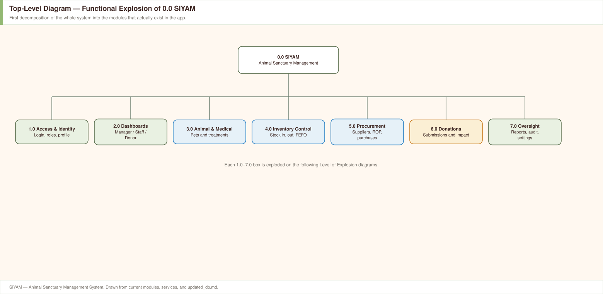

### 04 — Software structure

How the running app is layered. Pages call `SomeService()`; the factory
picks mock or Supabase from `kUseMock`. The UI does not branch on backend.

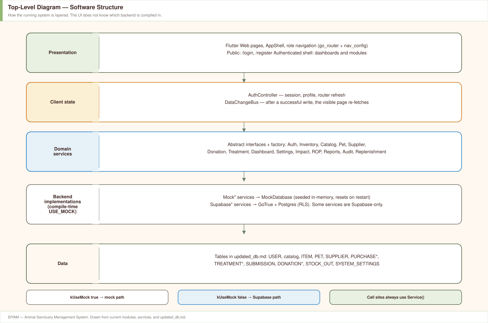

`PetService`, `SupplierService`, `ReportService`, `ReplenishmentService`, and
`AuditService` are Supabase-backed in the current code. The others still have
a mock factory path.

---

## Level of explosion

### 05 — 1.0 Access & Identity

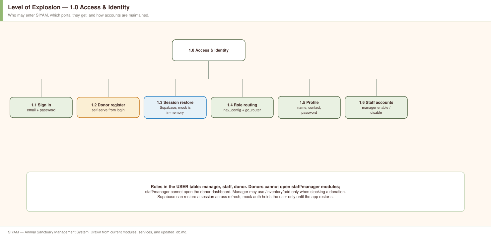

### 06 — 2.0 Dashboards

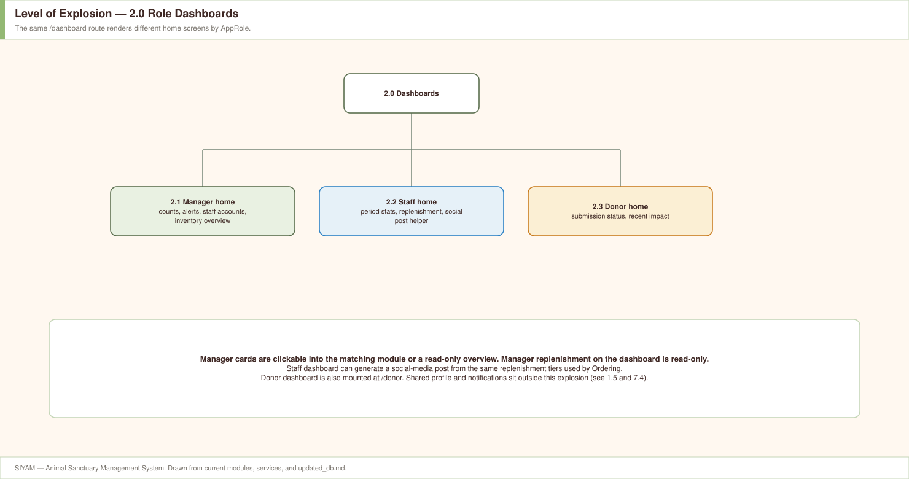

### 07 — 3.0 Animal & Medical Care

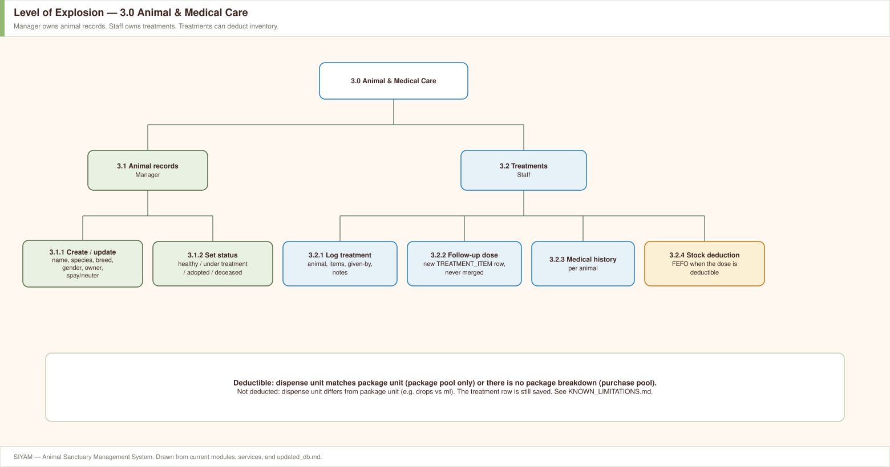

### 08 — 4.0 Inventory Control

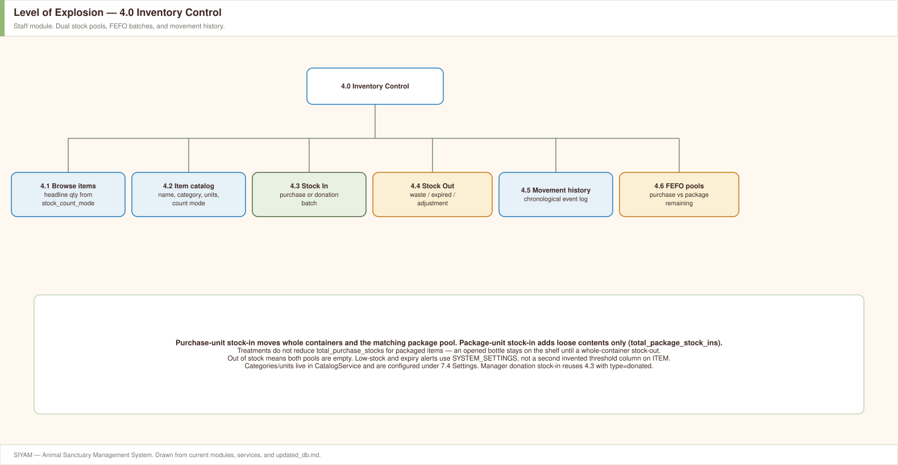

### 09 — 5.0 Procurement

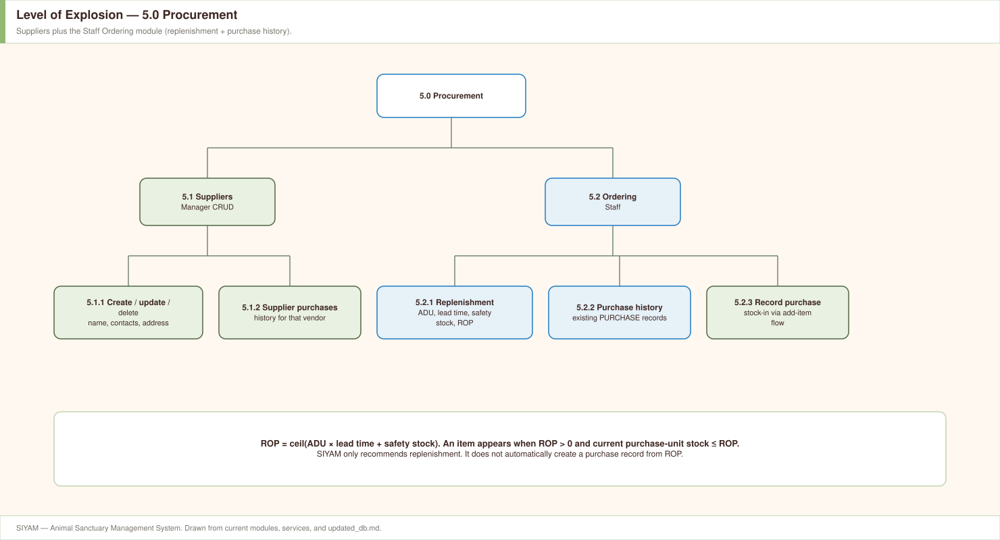

ROP formula used by Ordering: operational ROP =
`ceil(ADU × lead time + safety stock)` over a 30-day usage window. An item
is listed when `ROP > 0` and current purchase-unit stock `≤ ROP`. SIYAM
does **not** create a purchase from that recommendation.

### 10 — 6.0 Donations

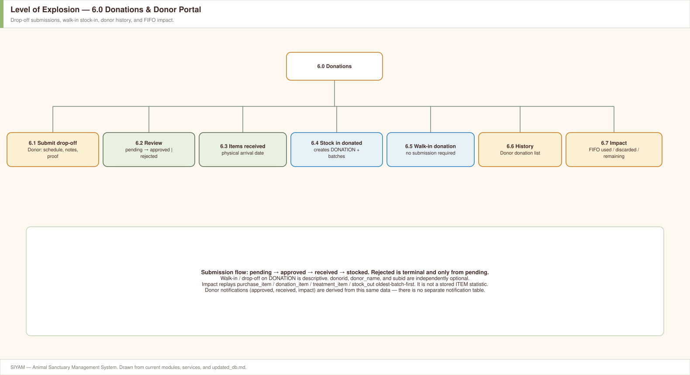

Submission flow: `pending → approved → received → stocked`. `rejected` is
terminal and only from `pending`.

### 11 — 7.0 Oversight

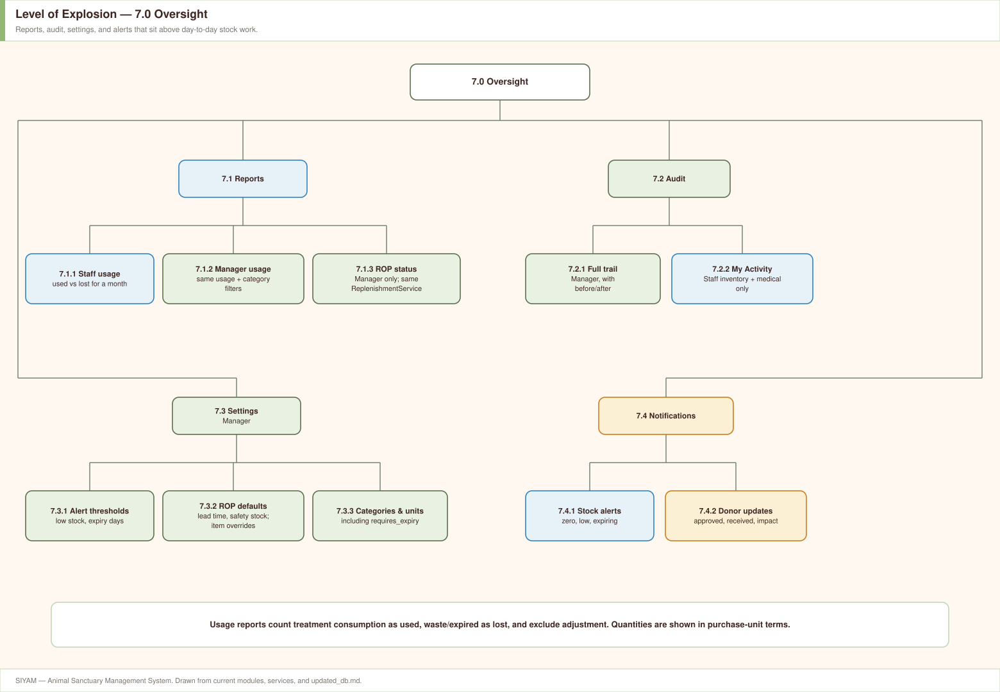

### 12 — Cross-module stock flow

Shared explosion of how stock actually moves. Not a fourth diagram type.

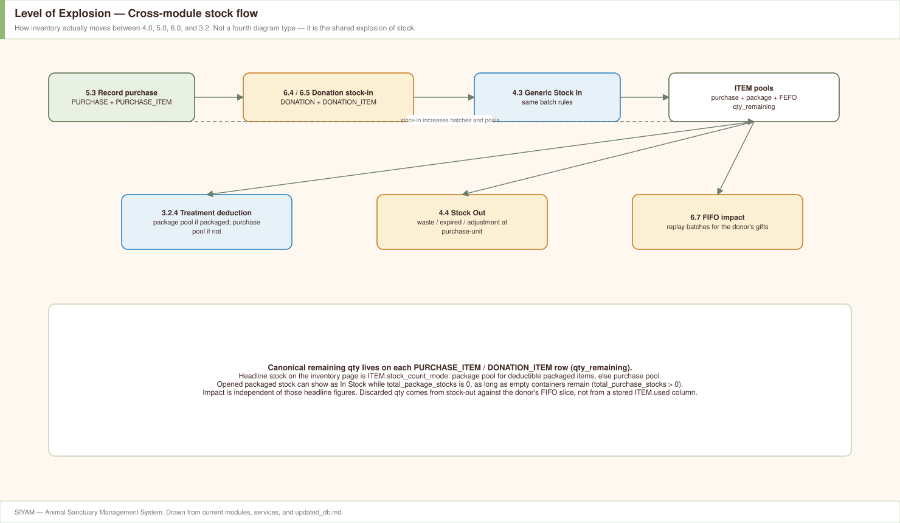

### 13 — Data stores

Tables from `updated_db.md`, grouped the way modules use them. `audit_log`,
`item_rop_settings`, and ROP columns on `system_settings` are drawn in a
separate group because they are used by services but are not listed in
`updated_db.md`.

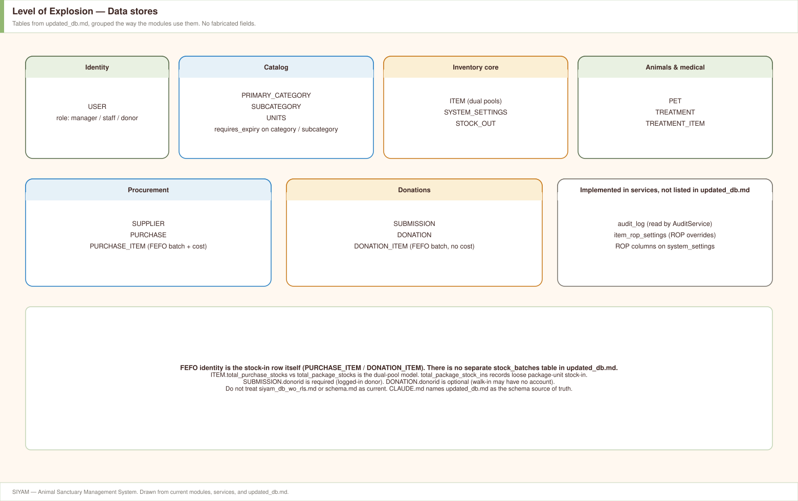

---

## What these diagrams do not claim

- They are not a promise to add tables or screens.
- `siyam_db_wo_rls.md` and `schema.md` are stale (see `CLAUDE.md`).
- There is no separate `stock_batches` table in `updated_db.md`; a FEFO
  batch is a `PURCHASE_ITEM` / `DONATION_ITEM` row.
- Donor notifications are derived from submissions and impact, not from a
  notification table.
- Unused / In-Use / Used stock figures were removed from `ITEM`; usage is
  the stock-movement history, and donor impact is a FIFO replay.
